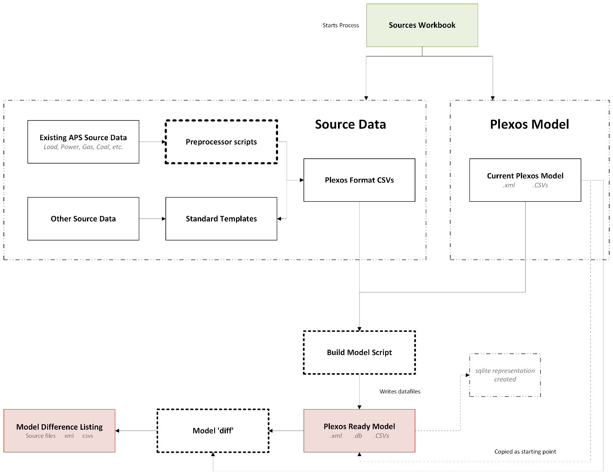
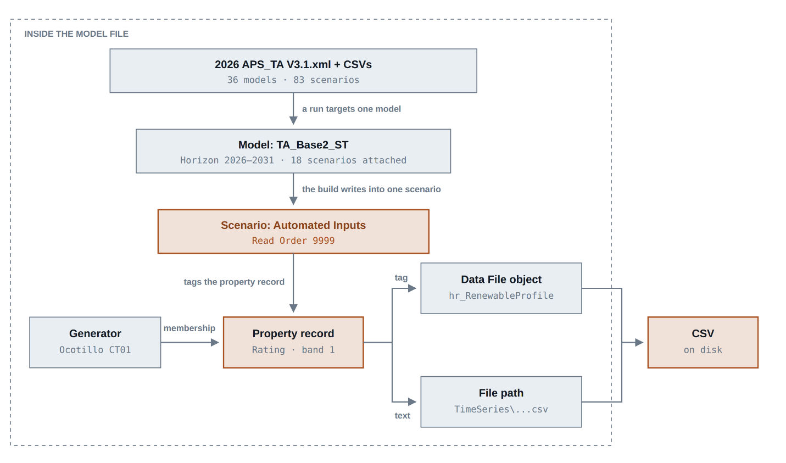
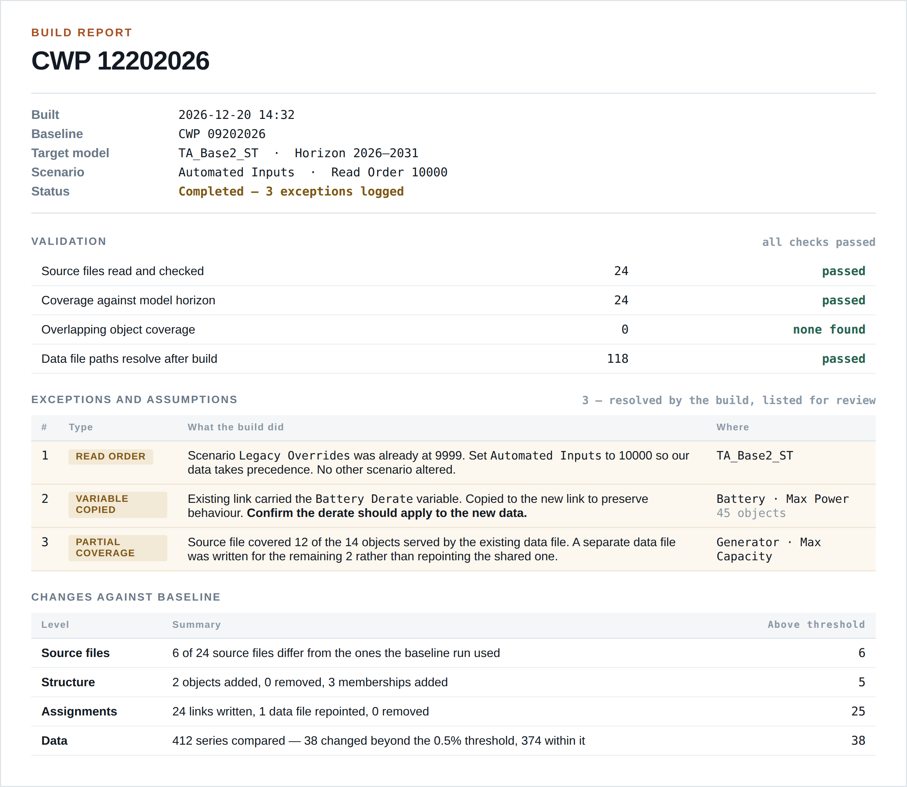

# Task 5: Plexos Input Pipeline

## Overview: The full process of converting APS source data to a Plexos ready model

This task focuses on pulling APS business data into a run-ready Plexos model. The build focuses on auditability, where a key is copying and tracing all data used an modifications made to create the model. All data is stored in a folder, where inputs and outputs of the model live. Inputs include the following:

- Plexos Model Files (.xml, .db, and .CSVs) for original and modified models

- Copy of Source files referenced

- Input workbook which runs the process

- Change report, which outlines all differences between original and modified models

An excel workbook is used to run the process (format discussed in D6).

The key to the method is it starts from a specified baseline archived Plexos model (likely the CWP, but may be an intermediate). It copies the specified starting model into the dedicated folder and begins modifying the copied model.

Source data is added to the model in the form of Plexos formatted CSV data files, which have a general column listing of \[time columns\], obj1, …objN. Standard templates are provided to input source data into the correct format. Some existing APS source data requires pre-processing to transform into the correct format, while others require aggregation.

Note: Near-constant values should go into a CSV rather than being typed into the model. This keeps value changes and structural changes cleanly separated, which is what makes a readable run-to-run comparison possible at all. However, the model diff functionality can be run as a standalone call, so even data typed directly into the model can be captured.

## \[D3\]: The canonical data model 

APS requested a Canonical data model which can be queried to explore changes between models. The core issue is: Source data changes format and is not structured. Plexos’s standard model format, Raw XML, is not something a person can read or check, and validation needs something queryable to check against. The original plan called for building and maintaining a parallel database as the canonical layer to sort these issues. However, we have determined a separate database isn’t needed. Plexos’s own model, converted to its relational form, already is a normalized, queryable database of exactly the same content.

Plexos-CLI toolkit has functionality which converts that XML into a SQLite database and back (conversion necessary to write to the model programmatically). That database is a fully normalized relational store of the entire model: objects, classes, memberships, properties, values, data file links. It is queryable with ordinary SQL, needs no server, and cannot drift out of step with the model because it is the model.

| **Table**               | **Holds**                                                                      |
|-------------------------|--------------------------------------------------------------------------------|
| t_object                | Every object in the model (e.g. Ocotillo CT02)                                 |
| t_class                 | Object Type (e.g. generators, fuels, regions, lines, data files)               |
| t_membership            | Relationships between objects (e.g. which generator sits in which region)      |
| t_property              | The properties available on each collection (e.g. Rating, Max Capacity, Price) |
| t_data                  | One record per property value assigned to a membership                         |
| t_tag                   | Links a property record to the data file that supplies it                      |
| t_text                  | The file path that data file points at                                         |
| t_date_from / t_date_to | Optional validity window on a property record                                  |

Those tables are normalized, which is right for storage and awkward for reading (answering “what is this generator’s Rating set to?” means joining five tables). Thus, for quick human readability, we will also provide a small set of pre-joined views rather than an ETL pipeline:

| **View**     | **One row per**           | **Description**                                                                                                                |
|--------------|---------------------------|--------------------------------------------------------------------------------------------------------------------------------|
| v_membership | Relationship in the model | What objects exist and how they connect                                                                                        |
| v_property   | Property value assignment | What every object’s properties are set to, which file supplies each one, in which band, under which scenario, over which dates |

Notes (1): The model today doesn’t have an associated .db. Thus our process treats producing it as a required step rather than expecting to find one, and retains it alongside each archived run from now on.

\(2\) This is easily quarriable with DuckDB (direct call; no server) This is what comparison tool and the output reporting is built on. It can also be used with powerBI or similar.

## \[D4\]: Mapping APS data into Plexos

Mapping the source data to Plexos is routed via the source workbook. Source data location is entered and pointed to an attribute in the Plexos model. Source data is either entered directly into a standard template, or is converted from bespoke source into a standard template automatically (e.g. forecasted load).

### Source Data

Data is provided directly in Plexos’s own data file convention, which is \[time columns\], obj1,…objN. Time columns always a prefix of Year, Month, Day, Period, in that order (Year alone for annual data, Year, Month for monthly, all four for hourly). Everything after the time columns is data pointing to some object or attribute. Even for static values, we default to using a year column.

### **Wide — one column per object (illustrative)**

> Year,Ocotillo CT01,Ocotillo CT02,Redhawk 1
>
> 2026, 142.0, 142.0, 530.0
>
> 2027, 142.0, 142.0, 530.0
>
> 2028, 145.0, 142.0, 538.0

### **Single-object — one value column (illustrative)**

> Year,Month,Price
>
> 2026, 1, 38.40
>
> 2026, 2, 36.15
>
> 2026, 3, 33.90

*Note on error checking:* Every source file must cover at least the full horizon of the target model, and should not miss months or days. Files may extend past it at either end — the existing data routinely does, by five to ten years — but a file that stops short, or is missing data points, fails the build rather than raising a warning. This may change as it is discovered how Plexos handles this method.

*Note on Pre-processing data:* Existing data sources like load, power prices, gas prices, coal prices, and VER forecast are provided from APS business sources using bespoke formats. The build provides bespoke conversion functions to first convert that data into the standard templates. As a pre-processing step. Further, some data will need to be aggregated, such as nodal power prices, which will be done as a pre-processing step.

A supplemental document will be created which documents the specific treatment/pre-processing of data once those scripts are built.

### The Sources workbook

An example model is located in the task 5 sharepoint drive. It is explained below.

*Sheet 1: Run sheet*

Define high level information about the model being created, where it is copied from

| **Setting**       | **What User enters**                                                                                             | **Example**              |
|-------------------|------------------------------------------------------------------------------------------------------------------|--------------------------|
| run_name          | Name of the run folder to create; also identifies the run in the build report                                    | CWP 12202026             |
| output_root       | Where run folders are created                                                                                    | ...\Plexos models Folder |
| source_model      | The model file copied as this run’s starting point — a full path, wherever it lives                              | ...\2026 APS_TA V3.1.xml |
| source_timeseries | The data-file folder that travels with it. Blank means “the one beside the model, named as its own paths expect” | — blank —                |
| Target_model      | The Plexos model this run is building                                                                            | TA_Base2_ST              |

Note: The build stops if the run folder already exists rather than writing into or over it.

*Sheet 2: Data Sheet*

Once source data is prepared into standard, importable templates, the source workbook maps each file to one place in Plexos.

| **Column**        | **What APS enters**                                                         | **Example**                                             |
|-------------------|-----------------------------------------------------------------------------|---------------------------------------------------------|
| source_path       | Path to the file — script output or filled-in template, treated identically | hr_RenewableProfile.csv                                 |
| target_class      | Plexos class name                                                           | Generator                                               |
| target_collection | Plexos collection name                                                      | Generators                                              |
| target_property   | Plexos property name                                                        | Rating                                                  |
| target_object     | Only for single-object files; blank for wide files                          | — blank —                                               |
| target_folder     | Where the CSV is placed in the data-file tree; blank uses APS_Inputs        | — blank —                                               |
| notes             | Notes for auditability                                                      | Existing renewables w/o wind. Separate file enters that |

Class, collection and property are plain names, resolved against the live model at build time. Multiple rows may target the same property, each covering a different set of objects (the model already does this, with separate hourly Rating files for existing renewables and for planned resources). This needs no special handling. But if two rows targeting the same property cover any of the same objects, the build stops and reports an error.

### Writing CSVs as datafiles

We write all values as datafiles, attached to a scenario, following the current APS model structure. Generally the Plexos model holds a Data File object inside the model, which in turn points at a CSV on disk. The code is therefore always two operations: write the file, and wire it into the model. Files the build writes are named \[resolution\]\_\[source stem\].csv, where resolution is the smallest time column (yr\_, mn\_, dy\_, hr\_), and are placed in the folder named on that row's target_folder column — by default APS_Inputs, a folder alongside the existing category folders in the data-file tree. Keeping everything the build wrote in one place means it can be told apart from APS's own files at a glance, on disk, rather than only in a comparison. Files already in the model are never renamed or moved. If a property already has a link, a warning is displayed and recorded in the build report.

Note: All values written by the build are placed in a single scenario, named Automated Inputs (default, can be changed). The build adds its own link from the target attribute to the data file it writes, tagged with this scenario, and leaves any existing link in place. The new link mirrors the existing one in every other respect — bands, date ranges, time slices and any variables attached to it — so the two records differ only in the data file they read and the scenario that tags them.

Where two scenarios define the same data, Plexos reads them in Read Order and the last read wins, so a higher Read Order means higher priority. Scenarios default to zero and the highest currently set in the model is 2000. Rather than fix a value, the build reads the highest Read Order among the scenarios attached to the target model and sets ours one above it — so against today's model it would use 2001. No other scenario's Read Order is changed. Ties are not settled by Read Order: where two scenarios share a value, Plexos falls back to the order they appear in the interface, by category then alphabetically within category, so the winner would depend on the scenario's name. Taking one above the maximum avoids that. The value used, and the maximum it was derived from, are recorded in the build report every run.

Where an existing link carries a conditional variable, that variable is copied to the new link — data tagged with a conditional variable overrides read ordering, so a new link without it would silently lose and the build would report success having changed nothing. In the current model this affects Battery Max Power via the Battery Derate variable, and one Fuel Price via Fuel Adder for MKTGas. Each is named individually in the build report, because this is exactly the kind of assumption a comparison report cannot surface: the variable changes what Plexos computes while leaving the model's structure, its property records and its CSV values all identical.

The scenario is attached to the model named in target_model. A scenario only applies to models it is attached to, so this step is what makes the data take effect. Each build clears the contents of the scenario and rewrites it, so stale values are never reused. The scenario object itself is kept rather than deleted, since deleting it would also remove its attachment to the model — renaming the scenario in the workbook therefore leaves a previous build’s data in place under the old name if it needs to be kept.

## \[D5\]: Technical architecture 

The setup is intentionally infrastructure light and simple. There is no requirement for a dedicated server and no database to administer, and nothing in the pipeline depends on PLEXOS Cloud services (no DataHub, no Cloud Studies). Instead, everything can be run locally. Storage in APS NAS (e.g. H: or F: drive) is recommended.

Similar to reporting, there is a dependency on Energy Exemplar’s Cloud CLI (which is a locally installed executable). It is what performs the conversion between the model’s XML and its queryable form, and Energy Exemplar’s SDK require it.

### Components

| **Component**        | **Form**                                                    | **Runs**               |
|----------------------|-------------------------------------------------------------|------------------------|
| Preprocessor scripts | One small Python script per legacy source                   | On demand              |
| Standard templates   | Blank CSV files                                             | —                      |
| Sources workbook     | Excel                                                       | —                      |
| Build scripts        | Python, via Energy Exemplar’s SDK                           | Per run                |
| Validation           | Two checkpoints inside the build                            | Per run                |
| Comparison tool      | Python + DuckDB                                             | Per run, and on demand |
| Build report         | Plain text file — what the build decided                    | Per run                |
| Diff report          | Excel workbook — summary page, then a detail page per level | Per run, and on demand |

Data is stored In a dedicated folder created for each run which is created at the time the workbook is run. Below is an example.

> CWP 09202026/
>
> Inputs/
>
> Copy of Source Data/ every source file this run used
>
> 2026 APS_TA V3.1.xml the model Plexos opens
>
> 2026 APS_TA V3.1.db the same model, queryable \[new\]
>
> Timeseries/ the data files
>
> Sources_Workbook.xlsx the Run, Data and Compare sheets used
>
> build_report.txt what the build decided \[new\]
>
> diff_report.xlsx what changed since the baseline \[new\]
>
> Outputs/
>
> ... unchanged — outside this milestone

### Comparing two runs

A key functionality of this scope of work is the ability to identify changes made to models, which is currently a massive human time sink.

“What changed?” is really four questions, each identifying a different portion of the modeling. Each is thus handled by a separate function, answering a different question.

| **Level**        | **Question**                                         | **Sees**                                                                                | **Cannot see**                            |
|------------------|------------------------------------------------------|-----------------------------------------------------------------------------------------|-------------------------------------------|
| **Source files** | Did the raw inputs change before anything was built? | Which source files differ from the ones the baseline run used                           | Anything about the model                  |
| **Structure**    | Did the model’s shape change?                        | Objects and relationships added or removed                                              | Any value, or which file a property reads |
| **Assignments**  | Did anything get rewired or re-valued?               | Property values, and a property switched to a different data file                       | The numbers inside those files            |
| **Data**         | Did the numbers change, and by how much?             | Value-by-value differences with error and correlation statistics, gap and anomaly flags | Anything about model structure            |

The assignments level matters more than it looks. When a property is pointed at an updated CSV the model’s structure is untouched, so a simple structural comparison reports nothing at all. Without this level, the most routine kind of change in the process would be invisible.

Energy Exemplar’s own tooling covers the data level and nothing else, so the other three are ours to build. That is a larger share than we expected going in: Plexos Desktop has a built-in Create Change Database feature that looks like exactly the right tool, but it has no equivalent anywhere in the SDK or the command-line tools, so it cannot be driven from a script.

#### How the comparison identifies matching records

Records are matched between two runs by name — class and object name, the relationship they sit on, the property, band, scenario and date range — never by the internal ID numbers, which are assigned independently in each file and would report everything as changed. One consequence worth stating plainly: a renamed object appears as one removal plus one addition rather than a rename. There is no stable identifier in the model that would let us detect renames, and we have accepted that as expected behaviour rather than build around it — flag it if renames are common enough in your workflow to matter.

#### Running a comparison

The tool takes two run folders. If a folder holds more than one model file it asks which to use. It then prepares both models for querying itself. This can be run between any two models using a sheet in the workbook.

| **Setting**        | **What User enters**                      | **Example**             |
|--------------------|-------------------------------------------|-------------------------|
| model_1_path       | First model path                          | ...\2026 APS_TA V3.1\\  |
| model_2_path       | Second model path                         | ...\2026 CWP 09262026\\ |
| output_report_path | Where the comparison report is written to | ...\selected folder\\   |

### The build report

Every run produces two reports, filed in the run folder alongside the model, answering the two questions a modeller has before trusting a new run. The build report says what the build decided along the way; it is a plain text file that opens anywhere. The diff report says what changed since the baseline; it is a workbook with a summary page and a detail page for each level of change.

The second is why the build does not stop when it meets a condition it can resolve on its own. Where it adjusts a Read Order, copies a variable across to a new link, writes a separate data file rather than repointing a shared one, or reuses a data file already in the model, it proceeds and records what it did and why. Every assumption the build made for itself is listed, so a run that completed without interruption can still be reviewed for the decisions behind it.

They are kept separate for a reason. The build report is the home of everything a comparison cannot show — a Read Order chosen, a variable carried across to a new link, a data file placed by default, an object that no source file covered. None of those leave a trace in any of the four levels of change, so a clean diff report would read as though nothing had happened. Keeping them apart stops the one thing the comparison structurally cannot tell you from being filed behind five sheets of things it can. Input data that is malformed still stops the build — these reports cover conditions the build resolved, not errors it ignored.

*Figure 3 — Build report summary. Exceptions and assumptions are listed with what the build did and where, so each can be confirmed rather than assumed.*
